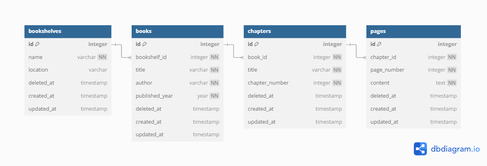

# Laravel Library API

This project implements a RESTful API for managing a digital library, including bookshelves, books, chapters, and pages, built with Laravel 12.

## Requirement Analysis
1. Implement full CRUD APIs for:
    - Bookshelves -> (name, location )
    - Books (under a bookshelf) -> (title, author, published_year )
    - Chapters (under a book) -> (title, chapter_number )
    - Pages (under a chapter) -> ( page_number, content)
2. Add a search endpoint for books by title or author
3. Add an endpoint that returns the full content of a chapter (by concatenating all its
pages)
4. Add simple token-based authentication
5. CI/CD Implementation is Must

## Features

- CRUD operations for Bookshelves, Books, Chapters, and Pages.
- Token-based authentication using Laravel Sanctum (Register, Login, Logout).
- Search functionality for books by title or author.
- Endpoint to retrieve the concatenated content of all pages within a chapter.
- Basic CI/CD pipeline using GitHub Actions for automated testing.

## Technologies

- PHP  8.4
- Composer
- SQLite
- Laravel 12

## Setup Instructions

1.  **Clone the repository or extract the zip file:**
    ```bash
    git clone https://github.com/jamiul/book-library-api.git
    cd book-library-api
    ```

2.  **Install dependencies:**
    ```bash
    composer install
    ```

3.  **Set up environment variables:**
    Copy the example environment file and generate an application key.
    ```bash
    cp .env.example .env
    php artisan key:generate
    ```

4.  **Configure the database:**
    -   By default, the application is configured to use SQLite.
    -   Ensure the `DB_CONNECTION` in your `.env` file is set to `sqlite`.
    -   Create the SQLite database file:
        ```bash
        touch database/database.sqlite
        ```

5.  **Run database migrations:**
    ```bash
    php artisan migrate
    ```

6.  **Start the development server:**
    ```bash
    php artisan serve
    ```
    The API will be available at `http://127.0.0.1:8000`.

## Detailed Outline

### Data Models

*   **Bookshelf:**
    *   `id` (Primary Key, Auto-increment)
    *   `name` (String, Required)
    *   `location` (String, Required)
    *   `created_at` (Timestamp)
    *   `updated_at` (Timestamp)
    *   *Relationship:* Has many Books
*   **Book:**
    *   `id` (Primary Key, Auto-increment)
    *   `bookshelf_id` (Foreign Key referencing Bookshelves, Required)
    *   `title` (String, Required)
    *   `author` (String, Required)
    *   `published_year` (Integer, Required)
    *   `created_at` (Timestamp)
    *   `updated_at` (Timestamp)
    *   *Relationship:* Belongs to a Bookshelf, Has many Chapters
*   **Chapter:**
    *   `id` (Primary Key, Auto-increment)
    *   `book_id` (Foreign Key referencing Books, Required)
    *   `title` (String, Required)
    *   `chapter_number` (Integer, Required)
    *   `created_at` (Timestamp)
    *   `updated_at` (Timestamp)
    *   *Relationship:* Belongs to a Book, Has many Pages
*   **Page:**
    *   `id` (Primary Key, Auto-increment)
    *   `chapter_id` (Foreign Key referencing Chapters, Required)
    *   `page_number` (Integer, Required)
    *   `content` (Text, Required)
    *   `created_at` (Timestamp)
    *   `updated_at` (Timestamp)
    *   *Relationship:* Belongs to a Chapter

### Database Diagram



### API Endpoints

(Refer to `routes/api.php` for a full list of endpoints and their corresponding controllers/methods.)

**Authentication:**

-   `POST /api/register`
-   `POST /api/login`
-   `POST /api/logout` (Requires authentication token)

**Bookshelves:** (Requires authentication token)

-   `GET /api/bookshelves`
-   `POST /api/bookshelves`
-   `GET /api/bookshelves/{id}`
-   `PUT /api/bookshelves/{id}`
-   `DELETE /api/bookshelves/{id}`

**Books:** (Requires authentication token)

-   `GET /api/books`
-   `POST /api/books`
-   `GET /api/books/{id}`
-   `PUT /api/books/{id}`
-   `DELETE /api/books/{id}`
-   `GET /api/books/search` (Query parameters: `title`, `author`)

**Chapters:** (Requires authentication token)

-   `GET /api/chapters`
-   `POST /api/chapters`
-   `GET /api/chapters/{id}`
-   `PUT /api/chapters/{id}`
-   `DELETE /api/chapters/{id}`
-   `GET /api/chapters/{id}/content`

**Pages:** (Requires authentication token)

-   `GET /api/pages`
-   `POST /api/pages`
-   `GET /api/pages/{id}`
-   `PUT /api/pages/{id}`
-   `DELETE /api/pages/{id}`

## Testing

Test on postman:
Import the collection.json file then test each endponts.
```bash
database\data\Library API.postman_collection.json
```

Run the automated tests using PHPUnit:

```bash
php artisan test
```

## CI/CD

A basic GitHub Actions workflow is included in `.github/workflows/deploy.yml` to run tests automatically on push/pull requests to the `main` branch.